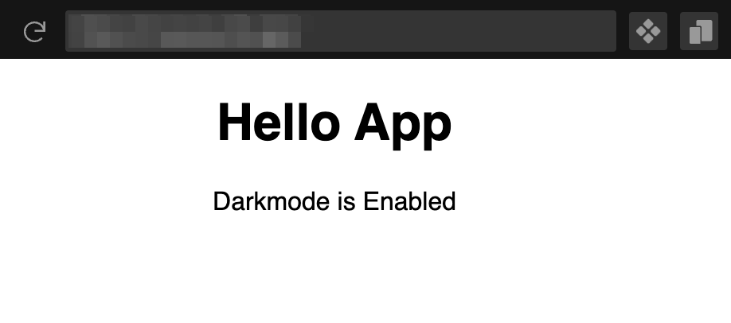

# :waxing_crescent_moon: Is Darkmode?


:unicorn: A Simple utility to find whether darkmode is enabled.

### :package: Requirements

Node.js 16.x LTS

### :sparkles: Installation

Install the NPM Package with the below command:

```
npm install is-darkmode --save
```

(or)

Install with Yarn:

```
yarn add is-darkmode
```

### :pen: Usage

Import the module in your project:

```javascript
// Commonjs Import
var { isDarkmode } = require("is-darkmode");

// or ES6 import
import { isDarkmode } from "is-darkmode";
```

### :bulb: Example

Inside your React app, Pass the function into a Variable.

With that you can conditionally render the content based on the result of the function.

```jsx
import { isDarkmode } from "is-darkmode";

export default function App() {
  const checkDarkmode = isDarkmode();

  return (
    <div className="App">
      <h1>Hello App</h1>
      <p>{checkDarkmode ? "Darkmode is Enabled" : "Darkmode is Disabled"}</p>
    </div>
  );
}
```

### :ballot_box_with_check: Example Output



---

#### :green_heart: Message

I hope you find this useful. If you have any questions, please create an issue.
